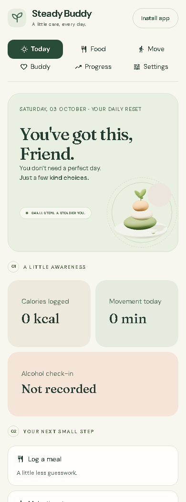

# Steady Buddy

A kind personal companion for calorie awareness, movement, patience, and alcohol-free days. Built with Streamlit, with installation controls for Community Cloud and an optional PWA gateway. No AI key, nutrition subscription, or tracking analytics.



## Open the app

Double-click **Start Steady Buddy.cmd**. The app opens at **http://localhost:8765** once the server is ready. Keep the running window open while using the app; closing it stops the server.

The isolated Python environment is already installed in this folder. If you move the folder or recreate the environment, use Python 3.12 and:

```powershell
uv venv --python 3.12 .venv
uv pip install --python .venv\Scripts\python.exe -r requirements.txt
.venv\Scripts\python.exe run.py
```

The launcher installs dependencies if the environment is missing. If port 8765 is already occupied, open the existing Steady Buddy instance or launch `run.py --port 8767` and use that address.

## What you can do

- **Today:** calorie intake logged so far, movement minutes, daily mood and alcohol check-in, and a gentle reminder.
- **Food:** editable example foods including Indian staples, custom food/drink entries, serving multipliers, favourites, corrections, and dated diaries. Confirm when all food and drinks for a date are logged.
- **Move:** choose a small action or rest day, log actual movement, and track your chosen weekly session goal.
- **Buddy:** encouragement for impatience, low motivation, alcohol cravings, difficult days, and small wins. A real two-minute pause timer runs in your browser.
- **Progress:** optional weigh-ins, an observed seven-calendar-day average, habit counts, and complete/partial calorie diaries.
- **Settings:** your name and reason, timezone, optional calorie reference, JSON backup/restore, and CSV exports.

Food values are illustrative estimates rather than a verified nutrition database. Adjust them using packaging, serving weight or recipe information. Calories include food and drinks; exercise calories are not deducted. A partial diary does not establish a calorie deficit. The app does not prescribe a calorie target or promise a weight-loss date.

Missed alcohol check-ins never count as alcohol-free days. A lapse does not erase prior progress. If you're dependent on alcohol or experience withdrawal symptoms, get medical help before stopping suddenly. Guidance links are included in the app: [NIDDK habit support](https://www.niddk.nih.gov/health-information/diet-nutrition/changing-habits-better-health), [NHS alcohol support](https://www.nhs.uk/live-well/alcohol-advice/alcohol-support/).

## Phone installation

### Streamlit Community Cloud

Open **https://steady-buddy.streamlit.app/**. The **Install app** button appears beneath the app title on every page. In supporting browsers it opens the browser's installation prompt; otherwise it shows instructions for your device. On iPhone/iPad, open the site in Safari and use **Share → Add to Home Screen**. Installation still needs your confirmation in the browser.

Deploy the GitHub repository's **main** branch with **app.py** as the entry point. The checked-in `.streamlit/config.toml` enables static serving for `static/manifest.json` and the bundled icons. Updates pushed to that branch are picked up by Community Cloud. No extra gateway, API key or external PWA host is needed.

Cloud diaries are separate for each browser, using a random private browser key. The app keeps a server-side SQLite diary and automatically saves a recovery copy in that browser. If Cloud resets its files, opening the app again in the same browser restores that copy. Clearing site storage removes the key and recovery copy; private browsing may remove them when it closes. Download a full JSON backup in Settings before clearing data or changing devices. Installing may use a separate storage area on some devices; use backup/restore to transfer records if necessary.

This is browser-based access, not an account login or automatic device sync. Someone using the same browser profile can open the same diary. For a personal shared-device deployment, use Community Cloud's app access settings or the password-protected gateway below. Server files are temporary, so a browser copy and downloaded backups remain essential. The old shared database from an earlier Cloud version is left untouched; import a previously downloaded JSON backup into the new browser diary to carry records over.

The Cloud installation needs an internet connection and a running app. It does not support offline diary writes, background notifications, or the gateway's offline screen. The manifest is attached to the outer Community Cloud page as well as direct Streamlit launches, so installation identifies Steady Buddy rather than the hosting platform.

### Local / container gateway

The app includes its web manifest, 192/512px icons, a maskable icon, service worker and an offline screen. Use the **main app address**, not the `/streamlit/` iframe address, to install it.

**A phone needs an HTTPS address to install this PWA.** The current app is running locally on your computer, not hosted publicly. `http://localhost` is installable on the computer itself; `http://192.168...` over ordinary Wi-Fi does not meet phone secure-context requirements.

Once hosted privately at an HTTPS address:

1. Open that address in your phone browser and unlock with your access password.
2. On iPhone, use **Share → Add to Home Screen**.
3. On Android, use **Install** in the app bar if the browser offers it, or the browser's **Install app** menu.

Tracking requires a connection to the running server. The service worker caches only public assets and the offline screen; it does not cache private diary data or save offline entries. Reminders are shown inside the app. Background push notifications aren't enabled.

## Private HTTPS hosting

Use a Python/container host with persistent disk and WebSocket support for the password-protected gateway and offline fallback. Community Cloud uses the direct Streamlit installation described above. Keep **one server worker and one instance** for the gateway's personal diary.

The container is supplied but has not been deployed. Set `BUDDY_ACCESS_PASSWORD` to a unique password of at least 12 characters, then:

```powershell
docker compose up -d --build
```

`compose.yaml` binds port 8765 to loopback and keeps the database in the `buddy-data` volume. Put an HTTPS reverse proxy in front of it. A minimal Caddy configuration, after assigning a domain to your server, is:

```caddyfile
your-domain.example {
    reverse_proxy 127.0.0.1:8765
}
```

For a managed hosting service, run `python run.py --host 0.0.0.0`, use its assigned `PORT`, attach persistent storage and set `BUDDY_DB_PATH` to that storage's SQLite path. Configure `FORWARDED_ALLOW_IPS` for the actual trusted HTTPS proxy IP(s) so secure cookies and origin checks see HTTPS correctly; don't trust arbitrary internet clients as proxies. The same applies to a Docker proxy whose IP differs from loopback.

Remote binding is rejected without the access password. The password protects HTTP, download/media routes and WebSockets. Sessions last up to seven days. Lock closes the current app connection and clears its access cookie. Changing the password and restarting invalidates existing signed sessions. Always use HTTPS before entering personal data remotely.

## Data and backups

Default database: `data/buddy.db`, wholly separate from your other projects. `BUDDY_DB_PATH` can choose another location. Keep downloaded backups private: they contain your food, weight and check-in records.

Use Settings → Download full backup regularly, particularly before moving servers. Restores validate records before replacing data and use a single transaction. A pre-restore SQLite safety copy is stored beside the diary in `backups/`. Back up live SQLite via the app's export or SQLite backup API rather than copying only the main `.db` while its WAL is active.

## Verification

```powershell
uv pip install --python .venv\Scripts\python.exe -r requirements-dev.txt
.venv\Scripts\python.exe -m pytest -q
.venv\Scripts\python.exe -m ruff check .
.venv\Scripts\python.exe -m playwright install chromium
```

The browser check writes test entries, so use a **separate test database**, not your own diary:

```powershell
$env:BUDDY_DB_PATH = "$PWD\output\browser-test.db"
.venv\Scripts\python.exe run.py --port 8766
# In another terminal:
.venv\Scripts\python.exe scripts\browser_check.py --url http://localhost:8766
```

To verify the Community Cloud behavior locally, launch Streamlit with `BUDDY_HOSTING=cloud`, `BUDDY_DB_PATH=output/cloud-test/buddy.db`, and run `scripts/browser_check.py --url http://localhost:8501 --direct`. This check preserves and renames only the disposable test diaries under `output/cloud-test/` to simulate a Cloud disk reset, then checks automatic recovery. Never point this test at your real diary or the live app.

Evidence and screenshots are saved in `output/`. Use `scripts/make_icons.py` only to regenerate the bundled icons, then copy them into `static/icons/` for the Cloud installation. No nutrition/AI provider is connected.
